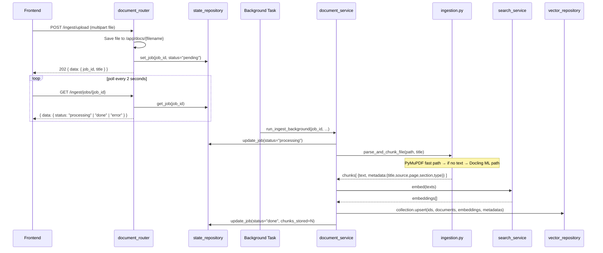
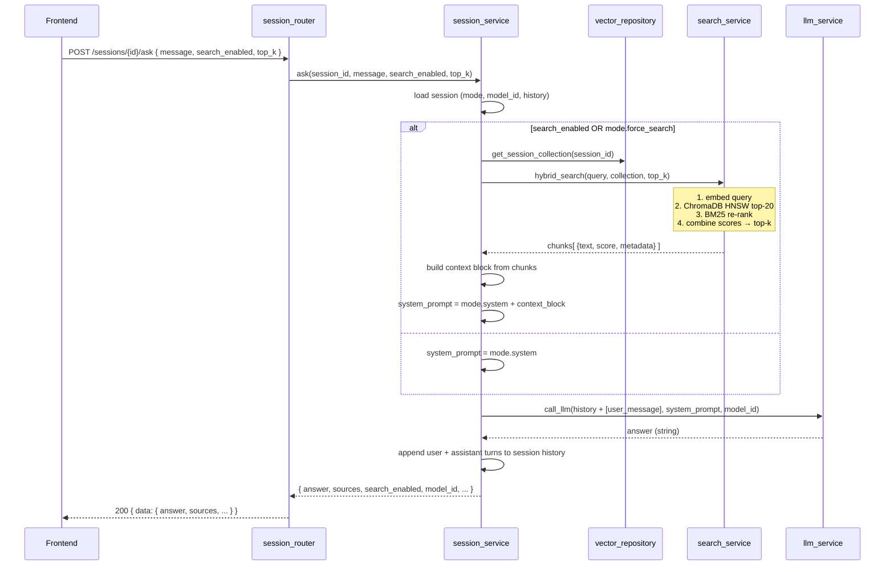

# Architecture

## Layered backend architecture

The backend follows a **Controller → Service → Repository** pattern. Each layer has one responsibility and only calls the layer below it.

```
HTTP Request
     │
     ▼
┌─────────────┐
│   Routers   │  Parse request, call one service function, return DataResponse
└──────┬──────┘
       │
       ▼
┌─────────────┐
│  Services   │  Business logic. Orchestrate repositories and other services.
└──────┬──────┘  Raise ErrorResponse for domain errors.
       │
       ▼
┌─────────────┐
│Repositories │  Data access only. Own the ChromaDB client and in-memory stores.
└─────────────┘
```

ngleton initialisation

Services and repositories use module-level singletons initialised once during app startup via FastAPI's `@asynccontextmanager` lifespan:

```
lifespan start
  │
  ├── register custom modes from config.json
  ├── vector_repository.init()   → creates ChromaDB HttpClient
  ├── llm_service.init()         → builds per-model AsyncOpenAI client pool
  └── search_service.init()      → creates embedding OpenAI client
```

This avoids per-request connection overhead and keeps the hot path (answering questions) as fast as possible.

---

## Technology choices

### ChromaDB

An embedded-first vector database that runs as a lightweight HTTP service. Chosen over alternatives because:

- no external cloud dependency (fully local)
- built-in HNSW index with cosine similarity
- simple Python client with no schema management
- supports metadata filtering (used to scope documents per session and per `doc_id`)

Collections are created dynamically — one global collection (`rag_docs`) and one per session (`session_{uuid}`). This gives each session an isolated document scope without any cross-contamination.

### Hybrid search: vector + BM25

Pure dense vector search is excellent at semantic similarity but can miss exact keyword matches (model names, version numbers, proper nouns). Pure BM25 is excellent at keywords but misses semantic equivalents ("cardiac arrest" vs "heart attack").

The retrieval pipeline combines both:

1. **ChromaDB HNSW** retrieves the top 20 candidates by cosine similarity of dense embeddings
2. **BM25Okapi** re-ranks those 20 candidates using term frequency against the query
3. Scores are combined: `0.6 × vector_score + 0.4 × bm25_score`
4. The top-k results are returned

The candidate pool (20) is larger than the final top-k (5 default) so BM25 has enough candidates to meaningfully re-rank. The 0.6/0.4 split favours semantic understanding while still giving keyword matches a significant boost.

### Docling (structured PDF parsing)

Most PDF parsers extract raw text in reading order and lose all structure. Docling runs an ML pipeline that:

- classifies every element (paragraph, heading, table, figure caption, footnote)
- builds a logical document tree with heading hierarchy
- outputs section breadcrumbs for each chunk (e.g. `Chapter 3 > Methodology > Data Collection`)
- handles multi-column layouts and complex table structures

This metadata is stored with every chunk and surfaced in the UI's sources panel. When a user sees `p.47 — Chapter 3 > Results > Table 2`, they know exactly where in their document the answer came from.

Docling is slow (10–60s per PDF) because it runs ML models for layout analysis. This is why file uploads are processed as background jobs — the HTTP response returns immediately with a `job_id`, and the client polls `/ingest/jobs/{job_id}` until status is `"done"`.

### PyMuPDF (fast PDF fallback)

For PDFs that are already text-based (not scanned), PyMuPDF extracts text in milliseconds using a pure C library. It is used as the **fast path** during ingestion:

1. Try PyMuPDF — if it finds text, use it
2. If the PDF appears to be scanned (no extractable text), fall back to Docling

This means simple PDFs are ingested in under a second, while scanned PDFs get full OCR-capable ML parsing.

### OpenAI-compatible client for all LLMs

The backend uses the `openai` Python library for all LLM and embedding calls. The `base_url` parameter is pointed at whichever provider is configured — Ollama, OpenAI, Anthropic's OpenAI-compatible endpoint, Azure, or any other compatible API.

This means zero provider-specific code. Adding a new LLM provider is purely a `config.json` change — no code changes required.

### MCP server

The MCP (Model Context Protocol) server exposes the knowledge base as callable tools to AI assistants. Rather than manually copying text into Claude, you can ask Claude directly to search your documents or ingest a new file. See [MCP Integration](MCP.md) for setup details.

The server uses **SSE (Server-Sent Events)** transport because it is the format supported by Claude Desktop and Claude Code, and it works across network boundaries without requiring WebSocket upgrade negotiation.

---

## Upload and ingest flow



**Key points:**

- The HTTP response returns immediately (202 Accepted) — the heavy parsing happens in the background
- Each chunk gets a `doc_id` stored in its metadata so all chunks belonging to a document can be found and deleted together
- Embeddings are generated in a single batched API call for efficiency

---

## Ask a question flow



**Key points:**

- The full conversation history is passed to the LLM on every turn — the model has complete context
- If search is enabled, the system prompt becomes `mode.system + retrieved context`. If not, only `mode.system` is used
- Sources are returned alongside the answer so the UI can show exactly what context the model was given
- Session history is stored in-memory on the backend; it is lost on container restart
